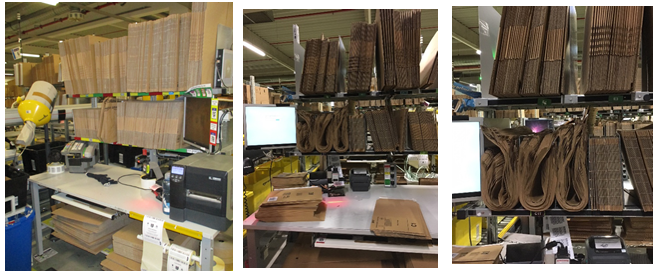
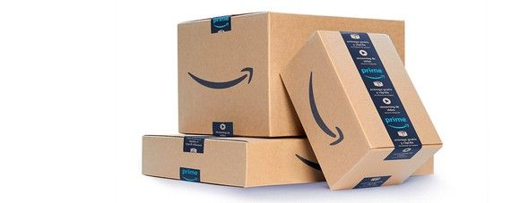
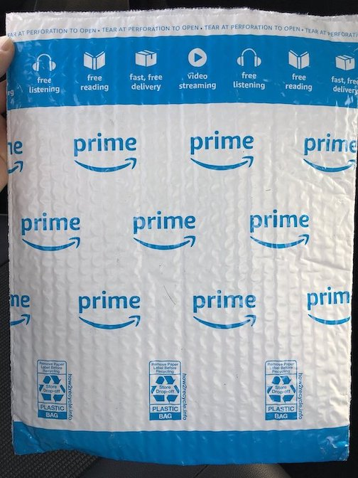
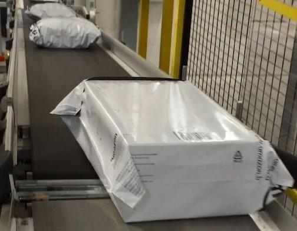
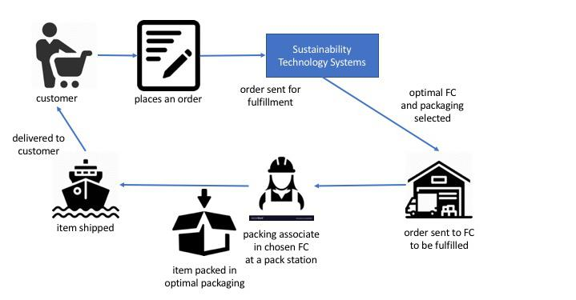

# Unit 3 Project: Sustainable Packaging

* * *

## Preliminaries: Been Here, Got the T-Shirt

You learned about how our projects are structured and work in the Unit 1 Project.

The Unit 3 project will be largely the same: we’ll still have Project Preparedness Tasks (PPTs) and Project Mastery
Tasks (MTs) that we check for completion and correctness with Task Completion Tests (TCTs).

There will also be a few differences.

### Welcome to the Cloud
In Unit 3 we’ll start **deploying our code to AWS**. We will still develop and run code locally, but our code
will also live in the cloud! This means that someone or something, a person or another team's code, can interact with
your service. Think about pictures that we have on our phones. When they get added to the cloud, we can share them
with other people. Other people can now see or use our photos, but they don't need our phones to do it. This is similar
to how teams at Amazon make their services available for customers to use. They put their code in a shared place, and
then invite customers to use it.

### Local Code Coverage Check
Just like in last unit, a couple checks will run on your code after it has been pushed and builds into the version set.

### Ambiguity, Complexity, and Scope.
We’re notching up the ambiguity in this unit's project. You'll notice that in the mastery tasks we will not be as
explicit about the exact implementation details. Remember, **we value success as a collaborative
effort**, so **ask and answer questions** amongst your peers and in Office Hours (do not make assumptions!). Coincidentally, developers
use these same collaborative skills every day, so you’ll be getting good practice for when you graduate. Complexity and
scope will also be increased in this project, but not hugely so.

&nbsp;

## Unit 3 Project Progress and Tracking

### Doneness checklist

You're done with this project when you've:

☐ All Task Completion Tests are passing

☐ Code Coverage Check passing

☐ Submitted Project Reflection response in Canvas

&nbsp;

## The Problem: Insisting on the Highest Packaging Standards

When customers order items from Amazon, they expect world-class service. That includes being responsible for the future
of our planet as we deliver value to each customer. As a new member of the Sustainability team, you will help Amazon
make environmentally smart decisions to live up to our customers' expectations.

Amazon chooses the best packaging option for each order from many available options. The "best" should not be
determined by just its packaging cost, but also its environmental impact. For example, sometimes the cheapest packaging
option is not the best choice because it ends up in a landfill instead of a recycling center, or because it is not
usable for returns. For the sake of this project, we will work with "singles" shipments, shipments that contain a single
item.

When an item is ready for shipment, it is sent to a packaging associate within the fulfillment center (FC) who places
the item in its packaging and sends it to the loading bay. These associates work at "packing stations" that include a
wide selection of packaging options. The packaging recommendation system tells the associate which packaging option to
use for each order. Packaging options vary by **type** and by **dimension**.

Each packing station has boxes and mailers of different sizes. The difference between a box and a mailer is a
difference in **type**, whereas the difference between a small box and a large box is a difference in **dimension**.
Refer to these typical packing stations to identify the boxes (the straight stacks) and the mailers (the curved
bundles).

&nbsp;



&nbsp;

Let’s take a closer look at some of the packaging **types** Amazon uses.

### Corrugate Box

&nbsp;



&nbsp;

Typically just called a "box," this is the most common type of packaging. You probably recognize the big Amazon smile
logo. They are relatively heavy compared to other packaging types. Some municipalities will recycle them, but the up
front material cost tends to be relatively high, and the quality of the cardboard degrades the more times they are
recycled. They are reusable as long as they are not damaged too much.

### SmartPack

&nbsp;



&nbsp;

SmartPacks are bubble mailers that can be recycled via store drop-off. They are harder to reuse than boxes because the
seal must be torn off to open the mailer. The bubbles offer some protection for fragile items, but mailers often result
in unnecessary packaging for smaller items. (We won’t work with these on this project.)

### Polybag

&nbsp;



&nbsp;

Smaller and lighter than both boxes and SmartPacks, polybags are made of 80% recycled plastic and are 100% recyclable.
They are also flexible, allowing a range of item shapes and sizes to be packed easily. Although they can be reused by
replacing the tape holding them shut, they do not protect their contents very well. (This project will involve adding
polybags as a packaging option to the existing shipment service.)

### Your task, should you choose to accept it...

As it stands, the software architecture of our service allows for a single packaging **type** with several
**dimensions**. As a member of the Sustainability team, you will extend the packaging recommendation system to make
environmentally smarter packaging selections. The packaging software runs in the "Sustainability Technology Systems"
part of the fulfillment process shown in this simplified
diagram:

&nbsp;



&nbsp;

You will extend the service to support different packaging types after calculating and considering their environmental
trade-offs. You will integrate these calculations into the selection process that decides how each item Amazon fulfills
is packaged.

## Technical Design

The SustainabilityShipmentService uses one API, `PrepareShipment`. This API provides the most cost effective
way to ship a single item from a specific fulfillment center (FC). The code to support this API is located in the
`ShipmentService` class. It is responsible for providing the shipment recommendation.

The `ShipmentService` uses the `PackagingDAO` to identify all shipping options available in an FC that will fit the
item. The `ShipmentService` then picks the shipment option with the lowest monetary cost and sends a shipping
recommendation back to the associate in the FC who is packing the item.

You will update the service to support different packaging types, and to also consider sustainability, not just
monetary cost, when choosing the best shipment option.

## Project Preparedness Tasks

We’re taking our first steps in native AWS with this project, so first an overview.

Thus far, we’ve written programs that work on our laptops. Java is designed to run on any computer that has a Java
Virtual Machine (JVM), so we could copy our code to almost any computer and run it there (this is sometimes called
"write once, run anywhere"). Even a computer in an entirely different building could run the program, as long as there
was some way to give it input and receive its output. A computer that runs programs without a human directly
interacting with it is often called a **server**.

Most of our programs aren’t all that challenging for a server, though. If we dedicated an entire server to running our
program, we’d be wasting a lot of its potential: after all, even our little laptops can run IntelliJ, email, Chime, and
a bunch of browser windows at the same time as our programs. An entire server dedicated to something like that would be
a huge waste of computer time, electricity, and money.

Ideally, we’d want a server *just* powerful enough to run our program. Computers that small are not available, but we
could use a larger computer to run a program that *emulates* many smaller computers at once, effectively converting a
large computer into multiple small servers. We can then provide one such small server for each program someone wants to
run.

AWS provides such servers. They’re called Elastic Compute Capacity (EC2) instances. But we can be even more frugal.

Many programs spend most of their time waiting for input. The rest of the time they’re just wasting electricity
waiting. Ideally, we could reduce power and computer usage by waiting until the service is called by a client, at which
point we could start an EC2 instance, install our program, run it, send back the result, and then turn off the EC2
instance so somebody else could use it. There’s a lot of overhead in turning the computer on and installing our
program, so we might want to leave it on for a minute or two just in case the same user had some more input.

AWS provides that capability, too. It’s called Lambda.

Because Lambda runs programs without a dedicated server, it’s considered "serverless". To be clear, there *is* a server
involved; we’re just not guaranteed anything about it except that it can run our program. It might run on one physical
computer the first time, and a completely different computer the next time. A better name might have been "transient",
but naming is hard, and "serverless" sounds more awesome. The team running the service doesn’t need to know anything
about the servers involved; Lambda takes care of it. And the team only pays for the time it actually spends running its
service. The waiting time between requests incurs no cost (unlike paying for an EC2 instance 24 hours per day).

To run a serverless program on demand, we must package it in a way Lambda understands, along with instructions that
tell Lambda what method to run and what resources the program accesses. AWS provides a way to define all this
information called the Serverless Application Model (SAM), along with a `sam` tool that lets us run Lambda programs
locally for testing.

To make use of these benefits, the `ShipmentService` runs on Lambda, so you’re going to get first-first hand experience
running a Lambda service!
## Project Mastery Tasks

These tasks are assigned in the appropriate module of the Sprint.

Unlike other units, not all Mastery Tasks apply to the Unit Project here in Unit 3.  Mastery Tasks 1 and 2 provide you with some experience and skills you may use when appropriate in this and subsequent units.  Therefore the running, testing and grading of Mastery Tasks 1 and 2 are different that for the rest of the unit.

Here is a summary of the Mastery Tasks and where they will be assigned:

**Mastery Task 1: That Cloud Looks Like a Log** - Sprint 1, Module 1 - Logging to the Cloud

**Mastery Task 2: Testing the Waters** - Sprint 1, Module 2 - Overview of Remote Debugging

**Mastery Task 3: Time is Marching On** - Sprint 1, Module 4 - Inheritance and Polymorphism

**Mastery Task 4: Time is Still Marching On** - Sprint 2, Module 3 - Maps

**Mastery Task 5: The Cost of Progress** - Sprint 2, Module 3 - Designing with Composition

**Mastery Task 6: I Fits, I Sits** - Sprint 3, Module 1 - Exception Handling

**Mastery Task 7: We Will Mock You** - Sprint 3, Module 3 - Mocking

### Special Consideration

```Because the Unit project is built incrementally through the Mastery Tasks, you may discover that tests may not pass on your local machine, but do pass when you submit your code to CodeGrade.  For example, when you are working on Mastery Task 3, tests may run for Mastery Tasks 4 through 7 on your local machine and fail since you have not yet completed those tasks.  This is expected and OK.  The CodeGrade evaluation for each Sprint does not test for Mastery Task to be completed in future Sprints.  As long as you pass the tests for the Mastery Tasks assigned in the Sprint and the CodeGrade evaluation for the Sprint passes you are good.```

### Remember: Smile when you code! ###
